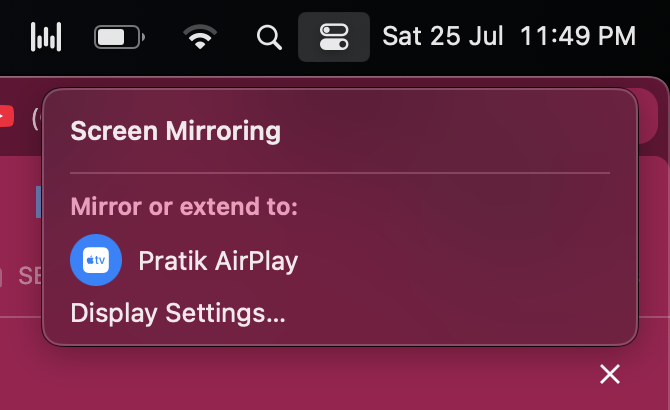

<div align="center">


# iMirror — AirPlay Screen Mirroring for Android TV

**Mirror your iPhone, iPad, or MacBook to any Android TV.** No Apple TV, no ads,
no watermark, no subscription.

[](LICENSE)
[](#supported-devices)
[-3ddc84)](#supported-devices)
[](apk/)
[](#no-ads-no-subscription-no-catch)

</div>

---

## Why this exists

**Many Android TVs and smart TVs do not come with AirPlay built in.** Depending on
the brand, the built-in feature might be called *AirPlay*, *AirScreen*,
*Air Mirror*, *Screen Mirroring*, *Smart View*, or *Miracast* — and on a lot of
budget or regional TV models it is missing entirely, broken, or locked behind a
paid app full of adverts.

iMirror solves that. It is an **AirPlay receiver you install as an APK on your
Android TV**, which makes the TV appear in the native Screen Mirroring menu on
your iPhone, iPad, or Mac. You then mirror your screen exactly as you would to an
Apple TV — no extra app on the phone, no account, no cable.

## Features

| | |
|---|---|
| 📱 **iPhone & iPad screen mirroring** | Appears natively in iOS Control Centre → Screen Mirroring |
| 💻 **MacBook screen mirroring** | Same AirPlay protocol; works from macOS Control Centre |
| 🔊 **Audio** | AAC-ELD, AAC-LC and ALAC, with independent A/V start and stop |
| ▶️ **Video streaming** | YouTube, Photos and other apps that push a stream URL, with play/pause/scrub |
| 🖼️ **Photos** | Full-screen images sent from the iOS Photos app |
| ⚡ **Low latency** | Hardware H.264 decode straight to the surface, tuned for interactive use |
| 🔒 **Optional PIN pairing** | Off by default; turn it on to stop neighbours connecting |
| 🎮 **TV remote control** | DACP reverse remote — the TV remote drives playback on your phone |

## No ads, no subscription, no catch

There is no paid tier, no watermark, no resolution cap, and no "upgrade to
1080p" prompt. The app contains **no billing, advertising, tracking, or analytics
code whatsoever**, and it never asks for your location. It is GPL-3.0 open source
— read the code and verify that yourself.

## Download

Prebuilt, release-signed APKs are committed in **[`apk/`](apk/)** — no build required.

| Your device | Download |
|---|---|
| Most Android TV boxes & sticks, Fire TV | [`armeabi-v7a`](apk/armeabi-v7a/) |
| Newer 4K Android TV / Google TV | [`arm64-v8a`](apk/arm64-v8a/) |
| Intel-based TVs, ChromeOS, emulators | [`x86`](apk/x86/) · [`x86_64`](apk/x86_64/) |
| **Not sure? Use this one** | [**`universal`**](apk/universal/) — works on everything |

Pick `universal` if you don't know your TV's CPU. See [`apk/README.md`](apk/README.md)
for how to check.

## Install on Android TV

Enable **Developer options → USB debugging** on the TV, then from a computer:

```sh
adb connect <your-tv-ip>
adb install -r iMirror-1.0.0-universal.apk
```

No computer? Use a sideloading app such as *Downloader* or *Send Files to TV* to
copy the APK to the TV and open it there.

## How to mirror

Open iMirror on the TV and leave it on the waiting screen. Then:

**From iPhone or iPad** — swipe into Control Centre → **Screen Mirroring** → pick your TV.

**From a MacBook or iMac** — Control Centre → **Screen Mirroring** → pick your TV.

<div align="center">



<sub>An Android TV running iMirror, appearing in the native macOS Screen Mirroring
menu — no extra software on the Mac.</sub>

</div>

The TV shows up under whatever name you set in Settings, alongside real Apple
devices. Nothing to install on the phone or Mac.

> Your phone and TV must be on the **same Wi-Fi network**. If a Mac session drops
> after a few seconds, turn off *Mirror audio* in Settings — macOS drives realtime
> audio clock sync harder than iOS does, and the audio path is the less mature
> half of the stack.

## Supported devices

- **Android TV / Google TV** — Android 7.1 (API 25) and newer
- **Amazon Fire TV** — sticks and cubes
- **Phones and tablets** — the same APK installs and runs, handy for testing

Senders: **iPhone**, **iPad**, and **Mac** running macOS 12 or newer.

## Known limitations

- **Netflix, Disney+, Apple TV+ will not mirror.** Apple's FairPlay DRM protects
  these on every AirPlay path. No open-source receiver can decrypt them — this is
  not a bug and cannot be fixed.
- **Apple Music in-app audio** is protected the same way. Route your Mac's system
  audio output instead, which works.
- **Same network required.** Apple TV can accept connections off-network via
  Apple's AWDL protocol; Android hardware cannot do AWDL.
- **H.264 only** — HEVC is not implemented yet.
- If your **router has AP isolation or multicast filtering** enabled, the TV will
  not appear in the AirPlay menu at all. mDNS discovery needs multicast.

## Build from source

Requires JDK 17+, and an Android SDK with NDK `28.2.13676358` and CMake 3.22.1.

```sh
git clone https://github.com/prat3ik/iMirror.git
cd iMirror
./gradlew assembleDebug
```

For a signed release build, supply your own keystore via `KEYSTORE_PATH`,
`KEYSTORE_PASSWORD`, `KEY_ALIAS` and `KEY_PASSWORD`.

## How it works

The app advertises `_airplay._tcp` and `_raop._tcp` over mDNS, presenting itself
as an Apple TV so senders select the mirroring protocol. Encrypted H.264 arrives
over TCP and is decoded by `MediaCodec` directly onto a `SurfaceView` with no
intermediate copy.

> **Contributor note:** the two mDNS registrations **must** stay serialized.
> Android's `NsdManager` cannot hold two registrations in flight — the second
> silently cancels the first and *neither* callback fires. The failure is
> invisible in logs and leaves the TV undiscoverable to iOS.

## License

**GPL-3.0** — see [LICENSE](LICENSE).

Forked from [PhairPlay](https://github.com/mazer666/PhairPlay) (Apache-2.0) and
bundles the [playfair](https://github.com/EstebanKubata/playfair) FairPlay
implementation, which is GPL. That component is what obliges the combined work to
be GPL-3.0. Full attribution and every third-party component are documented in
[NOTICE.md](NOTICE.md) — read it before forking.

## Trademarks

AirPlay, Apple TV, iPhone, iPad, MacBook and macOS are trademarks of Apple Inc.
iMirror is not affiliated with, authorized by, or endorsed by Apple Inc. The
protocol is implemented for interoperability only.

---

<div align="center">

**Keywords** — AirPlay receiver for Android TV · mirror iPhone to Android TV ·
MacBook screen mirroring to TV · iPad screen mirror · AirPlay for Google TV and
Fire TV · free screen mirroring app · AirScreen alternative · no-ads AirPlay APK

</div>
